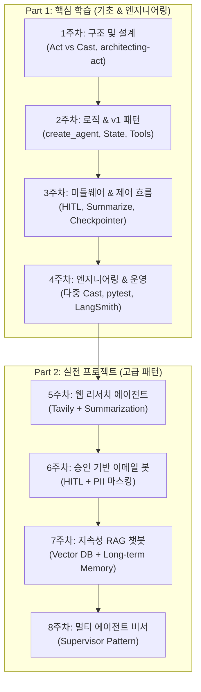

# 🚀 Act Operator 8주 완성 커리큘럼

**Act Operator** 커리큘럼은 `uv` 패키지 매니저와 AI 코딩 도구(Claude Code, Antigravity 등)를 활용하여, 설계부터 프로덕션 배포까지 실전 엔터프라이즈급 LangGraph 1.0+ 시스템을 체계적으로 학습하는 것을 목표로 합니다.

- **Part 1 (1~4주차)**: 핵심 개념, 아키텍처 및 미들웨어 시스템 학습  
- **Part 2 (5~8주차)**: 프로덕션 레벨 실전 프로젝트 구축

---

## 🛠️ 사전 준비사항 (Prerequisites)

- **Python**: `>= 3.11`
- **패키지 매니저**: [`uv`](https://github.com/astral-sh/uv) (`curl -LsSf https://astral.sh/uv/install.sh | sh` 또는 `powershell -c "irm https://astral.sh/uv/install.ps1 | iex"`)
- **AI 도구**: Claude Code CLI / Antigravity / Cursor 등
- **API 키 권장사항**:
  - `OPENAI_API_KEY` or `ANTHROPIC_API_KEY` (LLM 호출)
  - `TAVILY_API_KEY` (웹 검색 도구 실습)
  - `LANGSMITH_API_KEY` (4주차 이후 관측성 및 트레이싱)

---

## 🗺️ 8주 완성 아키텍처 진화 로드맵

---

## 📚 Agent Skills & CLI 퀵 레퍼런스

| 스킬 / 명령어 | 주요 역할 | 활용 시점 |
|---|---|---|
| `uvx --from act-operator act new` | 신규 Act 프로젝트 스캐폴딩 | 최초 프로젝트 시작 시 |
| `uv run act cast` | 모노레포 내 신규 Cast 모듈 추가 | 신규 그래프/워크플로우 추가 시 |
| `uv run act upgrade` | 프로젝트 내 스킬 및 템플릿 최신화 | 프레임워크/스킬 업데이트 시 |
| **`@architecting-act`** | 스무고개 요구사항 인터뷰 & CLAUDE.md 설계 | 그래프 아키텍처 초기 설계 시 |
| **`@developing-cast`** | StateGraph, 노드, 도구, 미들웨어 코드 구현 | 실제 그래프 컴포넌트 작성 시 |
| **`@engineering-act`** | 모노레포 의존성, `langgraph.json` 등록, 서브그래프 연결 | 다중 Cast 연동 및 설정 시 |
| **`@testing-cast`** | Pytest 유닛 테스트, Mocking 및 상태 검증 코드 자동 생성 | 테스트 및 품질 보증 시 |
| **`@publishing-act`** | LangGraph Cloud / Docker 배포 패키징 | 프로덕션 배포 준비 시 |

---

## 📖 Part 1: 핵심 학습 (1~4주차)

### 1주차: 환경 구축 및 아키텍처 설계 (Setup & Architecting)
> **목표**: Act Operator의 프로젝트 구조(Act vs Cast)를 이해하고, AI와 협업하여 첫 번째 그래프 아키텍처를 설계합니다.

- 📄 **문서 자료**: [Week1 상세 가이드](Week1.md) | [Week1 발표 슬라이드](Week1ppt.md)
- **핵심 학습 내용**:
  - **Act Operator 설치**: `uvx --from act-operator act new` 및 `uv sync` 의존성 관리
  - **Act vs Cast 개념**: 'Act'(최상위 모노레포)와 'Cast'(개별 StateGraph 패키지)의 구조적 차이
  - **AI 설계 협업**: `architecting-act` 스킬로 20-Questions 인터뷰 진행 및 `CLAUDE.md` 아키텍처 명세서 작성
- **실습 과제**: "주간 업무 보고서 작성기" Cast 생성 후 `modules/` 구조(`state.py`, `nodes.py` 등) 확인 및 아키텍처 다이어그램 검토

---

### 2주차: 핵심 로직 구현과 v1 패턴 적용 (Implementation & LangChain v1)
> **목표**: LangChain v1의 새로운 패턴인 `create_agent`를 활용하여 비즈니스 로직을 구현합니다.

- 📄 **문서 자료**: [Week2 상세 가이드](Week2.md) | [Week2 발표 슬라이드](Week2ppt.md)
- **핵심 학습 내용**:
  - **Developing Skill 활용**: `developing-cast` 스킬로 CLAUDE.md 명세를 `nodes.py`, `tools.py` 코드로 변환
  - **LangChain v1 마이그레이션**: 기존 `create_react_agent` 대신 `create_agent` 기반 에이전트 루프 구축
  - **상태 관리 (State Management)**: `state.py`에 TypedDict 기반 그래프 상태 스키마 정의 및 채널 리듀서 적용
- **실습 과제**: 검색 도구(Tavily 등)를 `tools.py`에 구현하고, 이를 호출하여 답변을 생성하는 노드를 `nodes.py`에 작성

---

### 3주차: 미들웨어와 제어 흐름 (Middleware & Control Flow)
> **목표**: Act Operator의 미들웨어 시스템을 적용하여 에이전트의 안정성과 제어권을 확보합니다.

- 📄 **문서 자료**: [Week3 상세 가이드](Week3.md) | [Week3 발표 슬라이드](Week3ppt.md)
- **핵심 학습 내용**:
  - **미들웨어(Middleware) 시스템**: Human-in-the-loop(승인 절차), Summarization(대화 요약), PII(개인정보 보호)
  - **제어 흐름 & 지속성**: `conditions.py`를 활용한 조건부 분기(Conditional Edge) 및 `Checkpointer` 상태 저장
  - **복합 패턴 적용**: AI에게 특정 도구 실행 전 "사용자 승인"을 요구하는 인터럽트 로직 추가
- **실습 과제**: 이메일 전송 전 승인을 요구하는 `HumanInTheLoopMiddleware` 적용 및 대화 압축 요약 미들웨어 구성

---

### 4주차: 엔지니어링 및 운영 최적화 (Engineering & Operations)
> **목표**: 다중 Cast 관리, 테스트 코드 작성, 그리고 LangSmith를 통한 관측 가능성을 확보합니다.

- 📄 **문서 자료**: [Week4 상세 가이드](Week4.md)
- **핵심 학습 내용**:
  - **다중 Cast 모노레포 관리**: `engineering-act` 스킬로 Cast 간 의존성(`pyproject.toml`) 조율 및 `uv run act cast` 추가
  - **테스트 자동화**: `testing-cast` 스킬로 pytest 기반 유닛 테스트 및 Mocking 코드 자동 생성
  - **관측 가능성 (Observability)**: `LANGSMITH_TRACING=true` 설정을 통한 그래프 실행 추적 및 디버깅
- **실습 과제**: 메인 챗봇 Cast에 '데이터 전처리 Cast'를 서브 그래프로 연결하고 전체 파이프라인 테스트 작성

---

## 🚀 Part 2: 실전 프로젝트 (5~8주차)

### 5주차: 지능형 웹 리서치 에이전트 (The Intelligent Researcher)
> **학습 목표**: Act Operator 기본 구조와 `SummarizationMiddleware`를 결합한 자동 문서화 에이전트 구축

- **프로젝트 개요**: 사용자 질의에 대해 웹(Tavily 등)을 탐색하고 요약 보고서를 생성하며, 토큰 초과 시 자동으로 문맥을 요약하는 시스템
- **핵심 모듈 구성**:
  - `tools.py`: 웹 검색 및 콘텐츠 추출 툴
  - `middlewares.py`: 토큰 제한 기반 대화 압축 요약 미들웨어
  - `agents.py`: `create_agent` 기반 리서치 플래너 및 라이터 노드

---

### 6주차: 승인 기반 이메일 자동화 봇 (Human-in-the-loop Email Assistant)
> **학습 목표**: 프로덕션 필수 요소인 Human-in-the-loop(중단/재개)와 개인정보(PII) 마스킹 미들웨어 구현

- **프로젝트 개요**: 이메일 초안 작성 후 실제 발송 전 사람의 승인을 받고, 본문 내 민감 정보(연락처, 계좌 등)를 자동 마스킹
- **핵심 모듈 구성**:
  - `HumanInTheLoopMiddleware`: 발송 도구 실행 전 Interrupt 및 승인/수정/반려 처리
  - `PIIMiddleware`: 개인 식별 정보 자동 감지 및 마스킹
  - `graph.py`: PostgresSaver/InMemorySaver를 통한 중단점 상태 영속성 관리

---

### 7주차: 지속성 메모리 기반 RAG 챗봇 (Persistent RAG Knowledge Base)
> **학습 목표**: 벡터 데이터베이스(Pinecone/Weaviate) 연동 및 장기 기억(Long-term Memory) 시스템 구축

- **프로젝트 개요**: 내부 지식 베이스 검색과 이전 세션 대화 맥락을 영구 기억하는 RAG 에이전트
- **핵심 모듈 구성**:
  - `tools.py`: 벡터 데이터베이스 유사도 검색 툴
  - `state.py`: 검색된 컨텍스트 및 히스토리 관리 스키마
  - `tests/`: 벡터 DB 연결 없이 로직을 검증하는 Mocking 테스트 작성

---

### 8주차: 멀티 에이전트 개인 비서 (Supervisor Pattern Assistant)
> **학습 목표**: 여러 하위 에이전트를 조율하는 중앙 감독자(Supervisor) 패턴 및 다중 Cast 모듈화 완성

- **프로젝트 개요**: 일정 관리(`calendar_cast`)와 메일 작성(`email_cast`) 등 전문 서브그래프에 작업을 분배하고 결과를 종합하는 슈퍼바이저 시스템
- **핵심 모듈 구성**:
  - `casts/`: 독립된 서브 패키지로 `calendar_cast`, `email_cast` 분리
  - `langgraph.json` & `pyproject.toml`: 다중 Cast 패키징 및 진입점 통합
  - `supervisor_node`: 사용자 의도 분류 및 동적 하위 Cast 라우팅

---

## 📊 커리큘럼 요약표

| 주차 | 단계 | 주제 | 핵심 키워드 | 관련 스킬 |
|:---:|:---:|---|---|---|
| **1주차** | Part 1 | 환경 구축 및 아키텍처 설계 | `Act vs Cast`, `CLAUDE.md`, 프로젝트 스캐폴딩 | `@architecting-act` |
| **2주차** | Part 1 | 핵심 로직 구현과 v1 패턴 | `create_agent`, `TypedDict`, 채널 리듀서 | `@developing-cast` |
| **3주차** | Part 1 | 미들웨어와 제어 흐름 | `HITL`, `Summarize`, `PII`, `Checkpointer` | `@developing-cast` |
| **4주차** | Part 1 | 엔지니어링 및 운영 최적화 | 다중 Cast, `pytest`, `Mocking`, `LangSmith` | `@engineering-act`, `@testing-cast` |
| **5주차** | Part 2 | 프로젝트 1: 웹 리서치 에이전트 | 웹 크롤링, 토큰 압축, 리포팅 | `@developing-cast` |
| **6주차** | Part 2 | 프로젝트 2: 이메일 자동화 봇 | `Interrupt`, 승인 절차, `PII 마스킹` | `@developing-cast` |
| **7주차** | Part 2 | 프로젝트 3: 지속성 RAG 챗봇 | `Vector DB`, 유사도 검색, Long-term Memory | `@developing-cast`, `@testing-cast` |
| **8주차** | Part 2 | 프로젝트 4: 멀티 에이전트 비서 | `Supervisor Pattern`, 다중 Cast 모노레포 | `@engineering-act`, `@publishing-act` |

---

## 💡 학습 팁 및 가이드

1. **에이전트 스킬 활용**: 기능 추가 및 수정 시 에이전트 스킬(`@architecting-act`, `@developing-cast` 등)을 적극적으로 호출하여 표준 컨벤션을 유지하세요.
2. **점진적 진화**: 1~4주차에서 기본 그래프 단위와 미들웨어를 철저히 익힌 후, 5~8주차 실전 프로젝트에서 복합 패턴을 적용하는 흐름을 따르는 것이 권장됩니다.
3. **지속적 테스트**: 코드 수정 후 반드시 `uv run pytest` 및 `ruff check`를 실행하여 안정성을 검증하세요.
