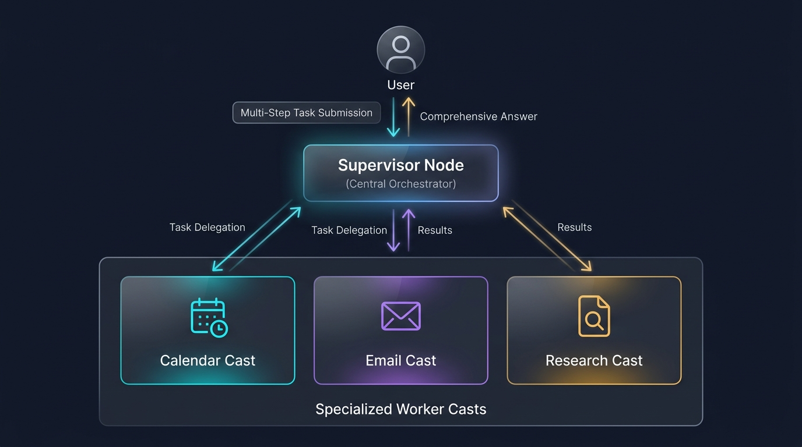
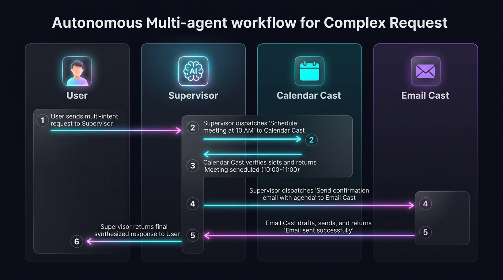

# 멀티 에이전트 개인 비서 (Supervisor Pattern Assistant)

> **문서 정의**: 단일 거대 에이전트 대신, 중앙 **감독자(Supervisor)**가 사용자의 복합 요청을 분석하여 특화된 **하위 전문 에이전트(Worker Casts)**들에게 작업을 분배·조율하고 최종 결과를 종합하는 **계층형(Hierarchical) 멀티 에이전트 아키텍처** 가이드입니다.  
> **관련 커리큘럼**: [Act Operator 8주차 프로젝트](file:///d:/git/act-operator/study/README.md#L142-L150) · LangGraph 1.0+ · `uv` workspace 기준

---

## 1. 등장 배경: 단일 거대 에이전트 vs Supervisor 패턴

| 비교 항목 | 단일 거대 에이전트 (Monolithic Agent) | Supervisor 패턴 (멀티 에이전트 비서) |
|---|---|---|
| **도구 수용량** | 20~30개 도구를 모두 주입하면 도구 선택 정확도 급락 | 워커별 2~4개 특화 도구만 격리 부여하여 정확도 극대화 |
| **프롬프트 품질** | 일정 규칙, 메일 보안, 사내 규정이 섞여 프롬프트 오염 발생 | 도메인별 독립 시스템 프롬프트 및 가드레일 분리 |
| **디버깅 & 테스트** | 실패 지점 파악이 어렵고 재현성 저하 | 하위 Cast별 독립 `pytest` 단위 테스트 및 관측성 확보 |
| **유지보수 & 확장** | 기능 추가 시 전체 프롬프트/로직 회귀(Regression) 위험 | 새 기능 추가 시 신규 Cast 생성 후 라우팅 목록만 추가 |

---

## 2. 아키텍처 구조 (Supervisor Topology)




---

## 3. 핵심 구성 요소

### 3.1 중앙 조율자 (`supervisor_node`)
- 사용자 의도를 파악하고 구조화된 출력(Structured Outputs, e.g. `RouterState`)을 사용하여 다음으로 호출할 워커(`next_worker`) 또는 종료(`FINISH`)를 결정합니다.
- 하위 에이전트들의 작업 결과를 누적 취합하여 최종 사용자에게 통합 답변을 생성합니다.

### 3.2 하위 전문 에이전트 (`Worker Casts`)
- 각자 독립된 `StateGraph`를 가진 서브패키지로 구축됩니다.
- **`calendar_cast`**: 캘린더 조회, 일정 충돌 감지, 일정 등록 도구만 보유
- **`email_cast`**: 메일 템플릿 생성, 수신자 검증, 메일 발송 도구 보유
- **`research_cast`**: 웹 검색, 문서 파싱, 데이터 요약 도구 보유

### 3.3 상태 라우팅 및 핸드오프 (Handoff)
- 슈퍼바이저의 판단 결과(`next`)에 따라 조건부 엣지(Conditional Edge)를 통해 동적으로 워커 노드를 실행합니다.
- 하위 워커의 실행이 완료되면 제어권이 다시 Supervisor로 반환되어 추가 작업 필요 여부를 재평가합니다.

---

## 4. 작동 시나리오 예시

> **사용자 요청**: *"내일 오전 10시에 김 팀장님과 미팅 잡고, 확정되면 미팅 안건 정리해서 팀장님께 확인 메일 보내줘."*




---

## 5. Act Operator 프로젝트 관점 구현 (`uv workspace`)

Act Operator의 모노레포 구조([study/Week-All.md:L697-L733](file:///d:/git/act-operator/study/Week-All.md#L697-L733))를 활용한 다중 Cast 패키징 구조입니다:

```text
my-act/
├── pyproject.toml                 # uv workspace (members = ["casts/*"])
├── langgraph.json                 # 각 Cast 및 Supervisor 그래프 진입점 등록
├── casts/
│   ├── supervisor/                # 중앙 조율 그래프 (의도 분류 및 조건부 라우팅)
│   │   ├── modules/
│   │   │   ├── state.py           # RouterState, TeamState 정의
│   │   │   └── nodes.py           # supervisor_node, summarize_node
│   │   └── graph.py               # 조건부 엣지 기반 오케스트레이션
│   ├── calendar_cast/             # 캘린더 전문 Cast
│   └── email_cast/                # 이메일 전문 Cast
└── tests/
    └── cast_tests/                # supervisor_test.py, calendar_cast_test.py
```

### 구현상 핵심 장점
1. **독립 스캐폴딩**: `uv run act cast --cast-name "Calendar" --lang kr` 명령으로 개별 서브그래프를 깔끔하게 분리 생성
2. **독립 단위 테스트**: 상위 슈퍼바이저 없이도 각 Cast를 개별 격리하여 `pytest`로 신속 검증
3. **무중단 확장성**: 회계, 번역, 리서치 등 신규 역량 추가 시 기존 비즈니스 로직을 변경하지 않고 신규 Cast를 추가한 뒤 Supervisor의 라우팅 대상에만 등록
