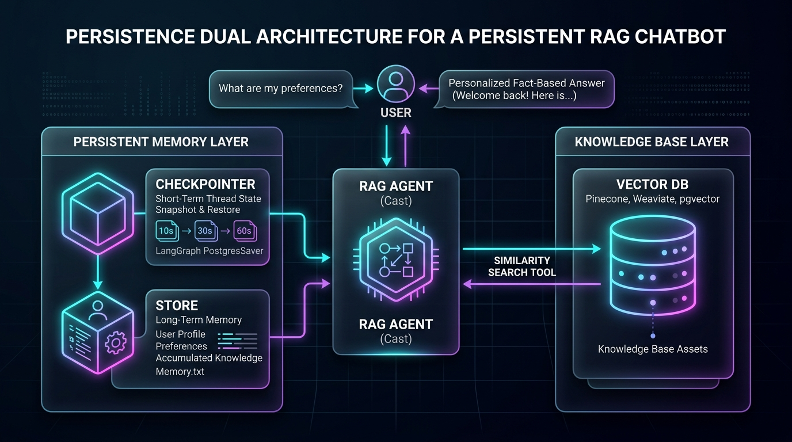
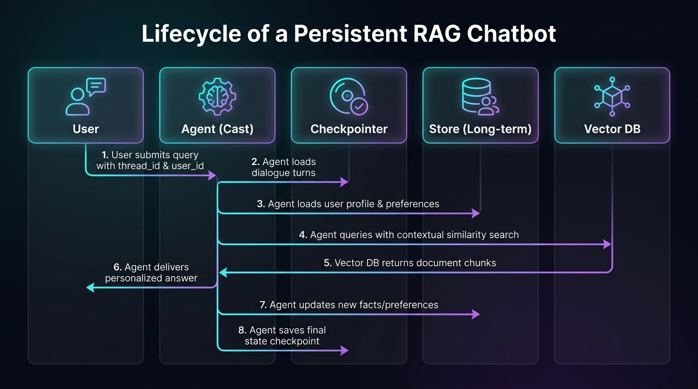

# 지속성 메모리 기반 RAG 챗봇 (Persistent RAG Knowledge Base)

> **문서 정의**: 사내 문서 및 지식 베이스를 검색하는 **RAG(검색 증강 생성)** 기능에, 세션이 끊겨도 사라지지 않는 **장기 기억(Long-term Memory) 및 상태 영속성(Persistence)** 메커니즘을 결합한 지능형 에이전트 시스템 가이드입니다.  
> **관련 커리큘럼**: [Act Operator 7주차 프로젝트](file:///d:/git/act-operator/study/README.md#L131-L139) · LangGraph 1.0+ · `uv` workspace 기준

---

## 1. 일반 RAG vs 지속성 메모리 RAG 비교

| 구분 | 일반 RAG 챗봇 | 지속성 메모리 기반 RAG 챗봇 |
|:---:|---|---|
| **지식 범위** | 사전에 벡터화된 정적 문서 데이터 | 정적 문서 + **사용자와의 상호작용 및 누적 지식** |
| **세션 기억** | 브라우저 새로고침이나 세션 종료 시 초기화 | **영구 저장소(DB/Store)**에 대화 기록 및 컨텍스트 보존 |
| **개인화 수준** | 모든 사용자에게 동일한 기준 검색 | 사용자 선호도, 이전 질문 맥락, 맞춤 설정 반영 |
| **상태 복구** | 서버 재시작 시 작업 중단 상태 유실 | **체크포인터(Checkpointer)**를 통한 작업/대화 복원 |

---

## 2. 지속성 메모리 이중 아키텍처 (Persistence Dual Architecture)

LangGraph 1.0+ 및 Act Operator 아키텍처에서는 메모리를 두 단계로 분리하여 다룹니다.

### 2.1 단기 실행 지속성 (`Checkpointer`)
- **저장 대상**: 그래프 상태 스냅샷 (단기 실행 상태, 최근 대화 턴)
- **격리 범위**: 단일 `thread_id` 내부
- **주요 용도**: Human-in-the-Loop(HITL) 인터럽트 중단/재개, 세션 내 대화 히스토리 유지, 장애 시 롤백 방지
- **대표 구현체**: `InMemorySaver`, `PostgresSaver`, `SqliteSaver`

### 2.2 장기 지식 영속성 (`Store` & Vector DB)
- **저장 대상**: 사용자 프로필, 세션 간(Cross-thread) 누적 지식, 교정된 사실
- **격리 범위**: 여러 스레드 및 전역 공유 (`user_id`, `namespace` 기준)
- **주요 용도**: 사용자 선호도 유지, 개인화된 응답 제공, 장기 메모리 축적
- **대표 구현체**: `langgraph.store` (InMemoryStore, PostgresStore) 및 외부 벡터 DB(Pinecone, Weaviate, pgvector 등)

---

## 3. 핵심 작동 흐름 (Lifecycle)

1. **컨텍스트 로드**: 사용자가 질문을 전달하면 `thread_id`로 최근 대화 상태(`Checkpointer`)를 불러오고, `user_id`를 기준으로 사용자 장기 기억(`Store`)을 로드합니다.
2. **맥락화 및 벡터 검색 (`tools.py`)**: 단편적인 질문이더라도 이전 대화 맥락을 결합해 재구성한 후, 외부 벡터 DB에서 관련성 높은 지식을 검색합니다.
3. **답변 생성 (`nodes.py`)**: 검색된 문서 내용(`context`) + 대화 기록(`messages`) + 사용자 프로필을 종합하여 환각 없이 일관된 답변을 생성합니다.
4. **지식 영구 갱신**: 대화에서 새롭게 파악된 사용자 정보나 교정된 사실을 백그라운드 노드/미들웨어에서 `Store` 또는 벡터 DB에 지속적으로 반영합니다.

---

## 4. Act Operator Cast 모듈 구성 (`act cast` 기준)

Act Operator의 독립 Cast 모듈로 구현할 때의 표준 디렉토리 역할입니다:

- **`modules/state.py`**: 검색된 컨텍스트 조각(`retrieved_docs`), 사용자 메타데이터, 대화 메시지 스키마 정의
- **`modules/tools.py`**: Pinecone / Weaviate / pgvector 등 벡터 DB 유사도 검색 도구 정의
- **`graph.py`**: `checkpointer`와 `store`를 주입하여 컴파일된 `StateGraph` 엔트리포인트 생성
- **`tests/`**: 외부 벡터 DB 접속 없이 테스트할 수 있는 모킹(Mocking) 및 상태 복원 검증 테스트 구성

---

## 5. 주요 도입 효과

1. **맥락 단절 해결**: 며칠 뒤 같은 시스템에 접속해도 이전 논의 내용과 형식을 기억하고 대화를 이어갈 수 있습니다.
2. **최신성 및 정확도 보장**: 사내 지식 베이스(RAG)를 기반으로 답변하므로 최신 회사 규정이나 문서를 정확히 인용합니다.
3. **지속적 진화**: 사용자와의 상호작용이 거듭될수록 지식과 프로필이 지속 저장되어 개인화된 비서로 발전합니다.
4. **엔터프라이즈 신뢰성**: 서버 장애 또는 재배포 시에도 체크포인터를 통해 대화 상태가 안전하게 복원됩니다.
