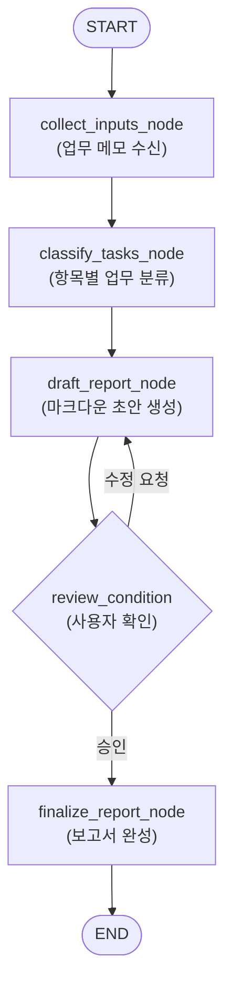
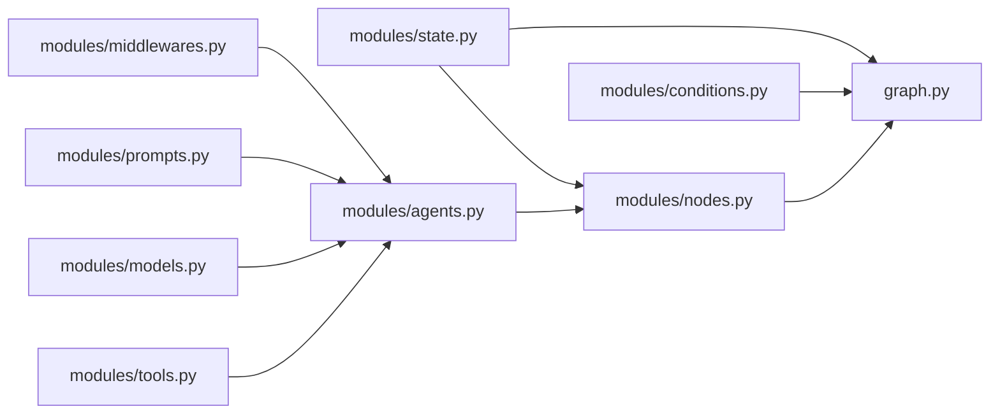

# Act Operator 통합 마스터 가이드 (Week 1~4 종합)

> **문서 목적**: Act Operator 기반 LangGraph 1.0+ 모노레포 프로젝트의 설계, 구현, 미들웨어 제어, 서브그래프 연동, 테스트 및 관측성(LangSmith) 전 과정을 다루는 AI 에이전트 및 개발자용 통합 가이드입니다.  
> **최신 확인일**: 2026-08-19 · LangChain `>=1.0.0`, LangGraph `>=1.0.0`, Python `>=3.11`, `uv` workspace 기준

---

## 📑 목차 (Table of Contents)

1. [0. 핵심 개념 및 아키텍처 개요 (Overview & Architecture)](#0-핵심-개념-및-아키텍처-개요)
2. [1주차: 환경 구축 및 아키텍처 설계 (Setup & Architecting)](#1주차-환경-구축-및-아키텍처-설계)
   - 1.1 개발 환경 준비 및 uv 구성
   - 1.2 Act Operator 설치 및 프로젝트 생성 (`act new`)
   - 1.3 Harness 패턴과 Act vs Cast
   - 1.4 프로젝트 구조 및 컴포넌트 분석
   - 1.5 AI 설계 협업: `architecting-act` 스킬
   - 1.6 실습: 주간 업무 보고서 작성기 설계
3. [2주차: 핵심 로직 구현 및 LangChain v1 패턴 (Implementation & LangChain v1)](#2주차-핵심-로직-구현-및-langchain-v1-패턴)
   - 2.1 `developing-cast` 스킬 및 하향식 구현 순서
   - 2.2 3-State 분리 패턴 (`state.py`) 및 Reducer
   - 2.3 도구 구현 (`tools.py`)
   - 2.4 모델 팩토리 & 프롬프트 (`models.py`, `prompts.py`)
   - 2.5 LangChain v1 에이전트 조립 (`agents.py` - `create_agent`)
   - 2.6 노드 구현 (`nodes.py` - `BaseNode` 상속)
   - 2.7 그래프 조립 및 컴파일 (`graph.py` - `BaseGraph` 상속)
   - 2.8 실습: 검색 도구 + 답변 생성 노드 완성
4. [3주차: 미들웨어와 제어 흐름 (Middleware & Control Flow)](#3주차-미들웨어와-제어-흐름)
   - 3.1 미들웨어 아키텍처 및 훅 실행 순서
   - 3.2 Human-in-the-Loop (HITL) 승인·수정·거절 흐름
   - 3.3 대화 요약(Summarization) & PII 보호 미들웨어
   - 3.4 커스텀 미들웨어 구현 (`AgentMiddleware`)
   - 3.5 상위 그래프 조건부 라우팅 (`conditions.py`)
   - 3.6 Checkpointer vs Store (상태 지속성)
   - 3.7 신뢰성 미들웨어 (Retry, Fallback, Call Limit)
   - 3.8 실습: 승인 기반 이메일 에이전트
5. [4주차: 엔지니어링 및 운영 최적화 (Engineering & Operations)](#4주차-엔지니어링-및-운영-최적화)
   - 4.1 Act 모노레포와 uv workspace 구조
   - 4.2 새로운 Cast 추가 (`act cast`) & `langgraph.json` 등록
   - 4.3 Cast 간 의존성 관리 및 빌드 설정
   - 4.4 서브그래프(Subgraph) 연결 및 Persistence 모드
   - 4.5 테스트 자동화 (`testing-cast`, pytest, 모킹, 커버리지)
   - 4.6 LangSmith 관측성(Tracing) 및 운영 모니터링
   - 4.7 실습: 데이터 전처리 Cast 서브그래프 통합
6. [5. 실전 트러블슈팅 및 운영 레퍼런스 (Troubleshooting & Reference)](#5-실전-트러블슈팅-및-운영-레퍼런스)
   - 5.1 CLI 명령어 치트시트
   - 5.2 실전 트러블슈팅 가이드
   - 5.3 프로덕션 운영 체크리스트
   - 5.4 주차별 핵심 퀴즈 및 정답

---

# 0. 핵심 개념 및 아키텍처 개요

### 0.1 컨텍스트 격차(Context Gap)와 Harness 패턴
AI 코딩 어시스턴트 사용 시 발생하는 가장 큰 문제는 **"세션이 바뀌면 아키텍처를 잊어버리고 제각각의 비표준 코드를 작성하는 현상(Context Gap)"**입니다. Act Operator는 3단계 Harness로 이를 해결합니다:

1. **Scaffolding (`act new`, `act cast`)**: 사전에 엄격히 구조화된 디렉터리 레이아웃과 표준 베이스 클래스(`BaseNode`, `BaseGraph`) 제공
2. **Executable SSOT (단일 진실 공급원)**: `CLAUDE.md`, `state.py`, Drawkit 다이어그램으로 아키텍처와 규칙을 코드베이스에 영구 보존
3. **Feedback Loop (Agent Skills)**: 에이전트가 내장 인터뷰 프로토콜과 구현 규칙에 따라 코드를 점진적·결정론적으로 작성하도록 강제

### 0.2 Act vs Cast 개념
```text
🎬 Act = 영화 한 편 (전체 모노레포 프로젝트 / uv workspace)
   🎭 Cast = 배역/역할 (독립된 StateGraph 단위 패키지)
```

| 구분 | Act (프로젝트 루트) | Cast (독립 모듈) |
|:---:|---|---|
| **범위** | 모노레포 리포지토리 전체 | 독립적인 단일 `StateGraph` 단위 |
| **위치** | 프로젝트 루트 (`/`) | `casts/<cast_snake>/` |
| **패키징** | 루트 `pyproject.toml`, `langgraph.json` | 개별 `pyproject.toml`, `graph.py` |
| **역할** | 인프라, 공통 설정, Cast 간 오케스트레이션 | 비즈니스 로직, 노드, 상태, 미들웨어, 도구 |

### 0.3 내장 5대 Agent Skills 맵
`act new` 실행 시 `.claude/skills/`에 다음 스킬들이 자동 번들됩니다:

| Skill | 주차 | 역할 및 핵심 역량 |
|---|:---:|---|
| **`architecting-act`** | 1주차 | 20-Questions 인터뷰 기반 요구사항 구체화, State 스키마 초안, 토폴로지 설계, `CLAUDE.md` 동기화 |
| **`developing-cast`** | 2~3주차 | LangChain v1 `create_agent` 패턴, 하향식 모듈 구현(`state`→`tools`→`agents`→`nodes`→`graph`), 미들웨어 적용 |
| **`engineering-act`** | 4주차 | 다중 Cast 의존성 해석, `langgraph.json` 등록, 서브그래프(Subgraph) 연결 및 어댑터 작성 |
| **`testing-cast`** | 4주차 | pytest 기반 노드 단위/그래프 통합 테스트 생성, 외부 의존성 모킹, Checkpointer 격리 테스트 |
| **`publishing-act`** | 배포 | LangGraph Cloud readiness 검증, Docker 컨테이너화, PyPI 배포 패키징 |

---

# 1주차: 환경 구축 및 아키텍처 설계

## 1.1 개발 환경 준비 및 uv 구성

| 소프트웨어 | 최소 버전 | 설치 확인 명령어 | 비고 |
|:---:|:---:|:---:|---|
| **Python** | `3.11+` | `python --version` | 최신 타입 힌트(`tomllib`, `slots`) 지원 |
| **uv** | 최신 | `uv --version` | Rust 기반 초고속 패키지/환경 관리자 |
| **Git** | 최신 | `git --version` | 버전 관리 및 협업 |

```bash
# uv 설치
# Windows (PowerShell)
powershell -ExecutionPolicy ByPass -c "irm https://astral.sh/uv/install.ps1 | iex"

# macOS / Linux
curl -LsSf https://astral.sh/uv/install.sh | sh

# 설치 확인
uv --version
```

## 1.2 Act Operator 설치 및 프로젝트 생성 (`act new`)

사전 설치 없이 `uvx`를 통해 최신 버전을 즉시 실행합니다:

```bash
# 대화형 모드
uvx --from act-operator act new

# 비대화형(CLI 플래그) 모드
uvx --from act-operator act new \
  --path ./report_system \
  --act-name "Report System" \
  --cast-name "Weekly Report" \
  --lang kr
```

> [!IMPORTANT]
> - 지원 언어 코드는 `kr` (한국어)과 `en` (영어)입니다. (`ko`는 지원하지 않음)
> - 프로젝트 생성 후 반드시 디렉터리로 이동하여 `uv sync`를 실행해 lockfile 동기화를 완료합니다.

```bash
cd report_system
uv sync

# LangGraph 개발 서버 구동 테스트 (macOS / Linux)
uv run langgraph dev

# Windows (PowerShell) 환경: 한글 주석으로 인한 cp949 디코딩 오류 방지
$env:PYTHONUTF8=1; uv run langgraph dev
```

> [!TIP]
> **Windows 환경 사용자 팁**:
> Windows 환경에서 `.env` 파일의 한글 주석 등으로 인해 `UnicodeDecodeError (cp949)`가 발생하는 경우, `$env:PYTHONUTF8=1`을 설정하거나 PowerShell 프로필에 추가하여 실행하세요.

## 1.3 프로젝트 디렉터리 레이아웃

```text
report_system/                      ← Act (모노레포 루트)
├── .claude/
│   └── skills/                     ← 번들된 5대 Agent Skills
│       ├── architecting-act/
│       ├── developing-cast/
│       ├── engineering-act/
│       ├── testing-cast/
│       └── publishing-act/
├── casts/                          ← Cast 모듈 저장소
│   ├── base_node.py                ← 모든 노드의 표준 베이스 클래스
│   ├── base_graph.py               ← 모든 그래프의 표준 베이스 클래스
│   └── weekly_report/              ← 개별 Cast 모듈
│       ├── modules/                ← 핵심 컴포넌트 디렉터리
│       │   ├── state.py            ← [필수] State/InputState/OutputState 스키마
│       │   ├── nodes.py            ← [필수] BaseNode 상속 노드 구현체
│       │   ├── graph.py            ← [필수] StateGraph 조립 및 컴파일 진입점
│       │   ├── agents.py           ← [선택] create_agent 기반 에이전트
│       │   ├── tools.py            ← [선택] @tool 도구 정의
│       │   ├── models.py           ← [선택] LLM 모델 팩토리
│       │   ├── conditions.py       ← [선택] 조건부 라우팅 함수
│       │   ├── middlewares.py      ← [선택] 라이프사이클 미들웨어
│       │   ├── prompts.py          ← [선택] 프롬프트 템플릿
│       │   └── utils.py            ← [선택] 헬퍼 유틸리티
│       ├── README.md               ← Cast 전용 설명서
│       └── pyproject.toml          ← Cast 전용 메타데이터
├── tests/                          ← 전체 테스트 스위트
├── drawkit_kr.xml                  ← Draw.io용 아키텍처 다이어그램 템플릿
├── langgraph.json                  ← LangGraph Studio 진입점 등록
├── pyproject.toml                  ← 루트 패키지 및 공유 의존성 설정 (uv workspace)
├── uv.lock                         ← 단일 lockfile
└── README.md                       ← 프로젝트 안내 문서
```

## 1.4 AI 설계 협업: `architecting-act` 스킬

### 1.4.1 인터뷰 프로세스
`@architecting-act`를 호출하면 AI는 20-Questions 기법으로 요구사항을 구체화합니다:
1. 입력 데이터 소스 및 포맷 (텍스트, DB, API 등)
2. 내부 처리 파이프라인 단계 및 분류 기준
3. Human-in-the-loop(검토/승인) 필요 여부
4. 최종 출력물 포맷 (JSON, Markdown, 외부 Webhook 등)

### 1.4.2 설계 산출물: `CLAUDE.md` 명세
인터뷰 결과는 루트 및 Cast 디렉터리의 `CLAUDE.md`에 저장되어 구현의 SSOT가 됩니다.



---

# 2주차: 핵심 로직 구현 및 LangChain v1 패턴

## 2.1 하향식 모듈 구현 순서 (Strict Order)

순환 참조를 방지하고 엄격한 타입 안정성을 유지하기 위해 반드시 다음 순서를 따릅니다:

```text
1. state.py           ← 🏗️ [기초] InputState / OutputState / State 정의
   ↓
2. 의존성 모듈들       ← 🔧 [부품] tools.py, models.py, prompts.py, agents.py, middlewares.py
   ↓
3. nodes.py           ← ⚙️ [로직] BaseNode를 상속받은 비즈니스 로직 노드
   ↓
4. conditions.py      ← 🔀 [분기] 조건부 엣지 라우팅 함수 (선택)
   ↓
5. graph.py           ← 🏭 [조립] StateGraph 빌드, 노드/엣지 연결 및 compile()
```



## 2.2 3-State 분리 패턴 (`state.py`)

외부 인터페이스를 깔끔하게 유지하고 그래프 내부의 풍부한 중간 상태를 분리 관리합니다:

```python
# casts/{cast_name}/modules/state.py
from __future__ import annotations

import operator
from typing import Annotated
from langchain_core.messages import AnyMessage
from langgraph.graph import MessagesState
from langgraph.graph.message import add_messages
from typing_extensions import TypedDict


class InputState(TypedDict):
    """외부 사용자가 그래프에 전달하는 최초 입력 인터페이스."""
    query: str


class OutputState(TypedDict):
    """그래프 실행 완료 후 외부에 최종 반환되는 출력 인터페이스."""
    result: str


class State(MessagesState):
    """그래프 내부 노드들이 공유하는 전체 상태 SSOT.
    
    MessagesState 상속 시 messages: Annotated[list[AnyMessage], add_messages] 자동 포함
    """
    query: str
    result: str
    search_results: Annotated[list[str], operator.add]
    revision_count: int
```

### Reducer 작동 원리

| Reducer | 동작 방식 | 코드 예시 |
|:---:|---|---|
| **기본 (None)** | 이전 값을 새 값으로 **덮어쓰기(Overwrite)** | `result: str` |
| **`operator.add`** | 리스트나 숫자를 **누적 추가(Append/Sum)** | `items: Annotated[list[str], operator.add]` |
| **`add_messages`** | 메시지 ID 기반 **스마트 병합(Merge/Append)** | `messages: Annotated[list[AnyMessage], add_messages]` |

## 2.3 도구 구현 (`tools.py`)

```python
# casts/{cast_name}/modules/tools.py
from __future__ import annotations

from langchain_core.tools import tool


@tool
def web_search(query: str, max_results: int = 5) -> str:
    """웹 검색 엔진을 통해 최신 정보를 검색합니다.

    Args:
        query: 검색할 질문 또는 핵심 키워드
        max_results: 반환할 최대 결과 수 (기본값 5)
    """
    return f"'{query}'에 대해 검색된 {max_results}개의 최신 정보 결과입니다."
```

> [!IMPORTANT]
> LLM은 함수의 **타입 힌트**와 **Docstring**을 기반으로 호출 여부를 판단합니다. 파라미터 타입과 인자 설명을 명확하게 작성해야 합니다.

## 2.4 모델 팩토리 & 프롬프트 (`models.py`, `prompts.py`)

```python
# casts/{cast_name}/modules/models.py
from __future__ import annotations

import os
from langchain_openai import ChatOpenAI


def get_chat_model(temperature: float = 0.1) -> ChatOpenAI:
    """중앙 집중식 모델 팩토리 함수."""
    return ChatOpenAI(
        model=os.getenv("OPENAI_MODEL_NAME", "gpt-4o"),
        temperature=temperature,
        timeout=30,
    )
```

```python
# casts/{cast_name}/modules/prompts.py
from __future__ import annotations


def get_system_prompt() -> str:
    """에이전트 시스템 프롬프트 반환."""
    return (
        "당신은 전문 리서치 어시스턴트입니다.\n"
        "제공된 도구를 활용하여 사실에 기반한 명확한 답변을 생성하세요."
    )
```

## 2.5 LangChain v1 에이전트 구성 (`agents.py`)

LangChain v1에서는 레거시 `create_react_agent` 대신 **`create_agent`**를 사용합니다:

```python
# casts/{cast_name}/modules/agents.py
from __future__ import annotations

from langchain.agents import create_agent
from .models import get_chat_model
from .prompts import get_system_prompt
from .tools import web_search


def create_search_agent():
    """LangChain v1 표준 create_agent 에이전트 생성."""
    return create_agent(
        model=get_chat_model(),
        tools=[web_search],
        system_prompt=get_system_prompt(),
    )
```

## 2.6 노드 구현 (`nodes.py` - `BaseNode` 상속)

모든 노드는 `casts.base_node.BaseNode`를 상속합니다:

```python
# casts/{cast_name}/modules/nodes.py
from __future__ import annotations

from typing import Any
from langchain_core.messages import HumanMessage
from casts.base_node import BaseNode
from .agents import create_search_agent


class InputNode(BaseNode):
    """사용자 입력을 메시지로 변환하는 노드."""

    def __init__(self) -> None:
        super().__init__(verbose=True)

    def execute(self, state: dict[str, Any]) -> dict[str, Any]:
        query = state.get("query", "")
        self.log(f"Received user query: {query}")
        return {
            "messages": [HumanMessage(content=query)]
        }


class SearchAgentNode(BaseNode):
    """ReAct 에이전트를 실행하는 노드."""

    def __init__(self) -> None:
        super().__init__(verbose=True)
        self.agent = create_search_agent()

    def execute(self, state: dict[str, Any]) -> dict[str, Any]:
        self.log("Invoking search agent...")
        response = self.agent.invoke({
            "messages": state["messages"]
        })
        last_message = response["messages"][-1]
        return {
            "messages": response["messages"],
            "result": last_message.content,
        }
```

## 2.7 그래프 조립 및 컴파일 (`graph.py` - `BaseGraph` 상속)

```python
# casts/{cast_name}/graph.py
from __future__ import annotations

from langgraph.graph import StateGraph, START, END
from casts.base_graph import BaseGraph
from casts.{cast_name}.modules.state import InputState, OutputState, State
from casts.{cast_name}.modules.nodes import InputNode, SearchAgentNode


class SmartSearchGraph(BaseGraph):
    """스마트 검색 Cast의 StateGraph 정의 클래스."""

    def __init__(self) -> None:
        super().__init__()
        self.input = InputState
        self.output = OutputState
        self.state = State

    def build(self):
        """노드와 엣지를 연결하여 컴파일된 그래프 반환."""
        builder = StateGraph(
            self.state,
            input_schema=self.input,
            output_schema=self.output
        )

        # 1. 노드 등록 (반드시 클래스 '인스턴스'를 등록)
        builder.add_node("input_node", InputNode())
        builder.add_node("search_node", SearchAgentNode())

        # 2. 엣지 연결
        builder.add_edge(START, "input_node")
        builder.add_edge("input_node", "search_node")
        builder.add_edge("search_node", END)

        # 3. 컴파일 및 반환
        graph = builder.compile()
        graph.name = self.name
        return graph


# langgraph.json에서 참조할 싱글톤 인스턴스
smart_search_graph = SmartSearchGraph()
```

---

# 3주차: 미들웨어와 제어 흐름

## 3.1 미들웨어 아키텍처 및 실행 순서

미들웨어는 `create_agent()`의 루프에 입력 검증, 로깅, 재시도, 승인, 요약 등의 횡단 관심사(Cross-cutting Concerns)를 삽입합니다.

| 종류 | 훅 (Hook) | 실행 시점 |
|---|---|---|
| **Node-style** | `before_agent`, `after_agent` | 에이전트 실행 전/후 1회 |
| **Node-style** | `before_model`, `after_model` | 매 LLM 모델 호출 전/후 |
| **Wrap-style** | `wrap_model_call` | LLM 모델 호출 전체를 감쌈 (Around) |
| **Wrap-style** | `wrap_tool_call` | 도구(Tool) 호출 전체를 감쌈 (Around) |

### 훅 실행 순서 규칙
`middleware=[A, B, C]` 등록 시:
- `before_*`: **A ➔ B ➔ C** (정방향)
- `after_*`: **C ➔ B ➔ A** (역방향)
- `wrap_*`: **A( B( C( target ) ) )** (A가 가장 바깥쪽을 감쌈)

## 3.2 Human-in-the-Loop (HITL) 승인 흐름

부작용(Side-effect)이 있는 도구(이메일 발송, 결제, DB 수정 등) 실행 전 사람의 승인을 받도록 차단합니다:

```python
# casts/{cast_name}/modules/middlewares.py
from __future__ import annotations

from langchain.agents.middleware import HumanInTheLoopMiddleware

hitl_middleware = HumanInTheLoopMiddleware(
    interrupt_on={
        "send_email": {
            "allowed_decisions": ["approve", "edit", "reject"],
        },
        "draft_email": False,  # 초안 작성은 승인 없이 허용
    },
    description_prefix="이메일 전송 승인 대기",
)
```

### 중단(Interrupt) 및 재개(Resume) 제어

HITL 실행 시 **Checkpointer**와 고유한 **`thread_id`**가 필수입니다:

```python
from langgraph.checkpoint.memory import InMemorySaver
from langgraph.types import Command

agent = create_agent(
    model=get_chat_model(),
    tools=[send_email],
    middleware=[hitl_middleware],
    checkpointer=InMemorySaver(),
)

config = {"configurable": {"thread_id": "email-001"}}

# 1. 초기 실행 -> send_email 직전 interrupt 발생
pending = agent.invoke(
    {"messages": [{"role": "user", "content": "team@example.com에 메일 전송해줘."}]},
    config=config,
    version="v2",
)
print("중단 상태:", pending.interrupts)

# 2. 사용자 승인 후 재개
agent.invoke(
    Command(resume={"decisions": [{"type": "approve"}]}),
    config=config,
    version="v2",
)
```

## 3.3 대화 요약(Summarization) & PII 보호

### 대화 자동 요약 (SummarizationMiddleware)
```python
from langchain.agents.middleware import SummarizationMiddleware

summarizer = SummarizationMiddleware(
    model=get_chat_model(),
    trigger=("tokens", 4_000),  # 4000 토큰 초과 시 트리거
    keep=("messages", 10),      # 최근 10개 메시지는 원본 유지
)
```

### 개인정보 마스킹 (PIIMiddleware)
전략: `block`(차단), `redact`(삭제), `mask`(마스킹), `hash`(해시화)
```python
from langchain.agents.middleware import PIIMiddleware

pii_middlewares = [
    PIIMiddleware("email", strategy="redact", apply_to_input=True),
    PIIMiddleware("credit_card", strategy="mask", apply_to_input=True),
    PIIMiddleware(
        "api_key",
        detector=r"act_[A-Za-z0-9]{32}",
        strategy="block",
        apply_to_tool_results=True,
    ),
]
```

## 3.4 커스텀 미들웨어 구현 (`AgentMiddleware`)

```python
from typing import Any
from langchain.agents.middleware import AgentMiddleware, AgentState, hook_config
from langchain_core.messages import AIMessage
from langgraph.runtime import Runtime


class MessageLimitMiddleware(AgentMiddleware):
    """메시지 수가 한도를 초과하면 안전하게 조기 종료."""

    @hook_config(can_jump_to=["end"])
    def before_model(
        self,
        state: AgentState,
        runtime: Runtime,
    ) -> dict[str, Any] | None:
        if len(state["messages"]) >= 50:
            return {
                "messages": [AIMessage("최대 대화 턴 수에 도달하여 종료합니다.")],
                "jump_to": "end",
            }
        return None
```

## 3.5 상위 그래프 조건부 라우팅 (`conditions.py`)

미들웨어가 에이전트 '내부' 루프를 제어한다면, `conditions.py`는 그래프 '외부' 토폴로지를 제어합니다:

```python
# casts/{cast_name}/modules/conditions.py
from typing import Literal
from .state import State


def route_by_result(state: State) -> Literal["review", "retry", "complete"]:
    """상태 값에 따라 다음 진행할 노드 반환."""
    if state.get("needs_review", False):
        return "review"
    if state.get("error") and state.get("retry_count", 0) < 3:
        return "retry"
    return "complete"
```

```python
# graph.py 연결
builder.add_conditional_edges(
    "process_node",
    route_by_result,
    {"review": "review_node", "retry": "retry_node", "complete": END},
)
```

## 3.6 상태 지속성: Checkpointer vs Store

| 구분 | Checkpointer | Store |
|---|---|---|
| **저장 대상** | 그래프 상태 스냅샷 (단기 실행 상태) | 애플리케이션 장기 데이터 |
| **격리 범위** | 단일 `thread_id` 내부 | 여러 스레드 및 전역 공유 |
| **주요 용도** | HITL 중단/재개, 대화 히스토리, 장애 복구 | 사용자 프로필, 장기 기억, 지식베이스 |

```python
from langgraph.checkpoint.memory import InMemorySaver
from langgraph.store.memory import InMemoryStore

graph = builder.compile(
    checkpointer=InMemorySaver(), # 운영 환경: PostgresSaver
    store=InMemoryStore(),
)
```

## 3.7 신뢰성 미들웨어 (Reliability)

```python
from langchain.agents.middleware import (
    ModelCallLimitMiddleware,
    ModelFallbackMiddleware,
    ModelRetryMiddleware,
    ToolCallLimitMiddleware,
)

reliability_middlewares = [
    # 1. 모델 장애 시 재시도
    ModelRetryMiddleware(
        max_retries=3,
        retry_on=(ConnectionError, TimeoutError),
        on_failure="error",
    ),
    # 2. 주 모델 실패 시 백업 모델로 전환
    ModelFallbackMiddleware(get_fallback_model()),
    # 3. 모델 무한 호출 방지 (최대 8회)
    ModelCallLimitMiddleware(run_limit=8, exit_behavior="end"),
    # 4. 중요 도구 호출 횟수 제한 (최대 1회)
    ToolCallLimitMiddleware(tool_name="send_email", run_limit=1, exit_behavior="error"),
]
```

---

# 4주차: 엔지니어링 및 운영 최적화

## 4.1 Act 모노레포와 uv workspace 구조

Act는 여러 Cast 패키지를 하나의 저장소에서 관리하는 `uv workspace` 기반 모노레포입니다:

```text
my-act/
├── pyproject.toml                 # workspace 정의 및 공통 dev 도구
├── uv.lock                        # workspace 전체가 공유하는 '단일 락파일'
├── langgraph.json                 # Studio 및 서빙을 위한 그래프 진입점 레지스트리
├── .env                           # 로컬 환경 변수 (Git 커밋 금지)
├── casts/
│   ├── base_graph.py              # 공통 BaseGraph
│   ├── base_node.py               # 공통 BaseNode
│   ├── chatbot/                   # Cast 1
│   │   ├── pyproject.toml
│   │   ├── graph.py
│   │   └── modules/
│   └── data_preprocessor/         # Cast 2
│       ├── pyproject.toml
│       ├── graph.py
│       └── modules/
└── tests/
    ├── conftest.py
    ├── cast_tests/                # <cast_snake>_test.py
    └── node_tests/                # test_<node>.py
```

### 루트 `pyproject.toml`의 Workspace 설정
```toml
[tool.uv.workspace]
members = ["casts/*"]
exclude = [
    "casts/__pycache__",
    "casts/**/__pycache__",
    "casts/**/.venv",
]
```

## 4.2 새로운 Cast 추가 (`act cast`)

기존 Act 프로젝트 내에서 새 그래프를 확장할 때 사용합니다:

```bash
uv run act cast --cast-name "Data Preprocessor" --lang kr
```

수행되는 자동 작업:
1. `casts/data_preprocessor/` 디렉터리 및 모듈 생성
2. `tests/cast_tests/data_preprocessor_test.py` 기본 테스트 생성
3. `langgraph.json`에 진입점 자동 등록

## 4.3 Cast 간 의존성 관리

```bash
# 특정 Cast에만 라이브러리 추가
uv add --package data-preprocessor pandas
uv add --package chatbot langchain-openai

# 테스트용 패키지는 루트 그룹에 추가
uv add --group test pytest-cov pytest-mock
```

> [!NOTE]
> Cast 코드는 기본적으로 Act 루트에서 `casts.<cast_name>` 네임스페이스로 import됩니다. 
> Cast를 완전한 독립 배포형 서브 패키지로 전환할 때만 `tool.uv.sources`를 선언합니다.

## 4.4 서브그래프(Subgraph) 연결 패턴

### 4.4.1 상태 스키마가 동일할 때: 그래프를 노드로 직접 등록
```python
from langgraph.graph import StateGraph, START, END
from casts.data_preprocessor.graph import data_preprocessor_graph

preprocessing_subgraph = data_preprocessor_graph()

builder = StateGraph(State)
builder.add_node("preprocess", preprocessing_subgraph)
builder.add_node("answer", AnswerNode())
builder.add_edge(START, "preprocess")
builder.add_edge("preprocess", "answer")
builder.add_edge("answer", END)
```

### 4.4.2 상태 스키마가 다를 때: 어댑터 노드(Adapter Node) 패턴 (권장)
```python
from casts.base_node import BaseNode
from casts.data_preprocessor.graph import data_preprocessor_graph


class PreprocessAdapterNode(BaseNode):
    """부모 State와 전처리 Cast State 간의 입출력을 매핑 변환."""

    def __init__(self) -> None:
        super().__init__()
        self.subgraph = data_preprocessor_graph()

    def execute(self, state: State) -> dict[str, object]:
        # 부모 State -> 자식 입력으로 변환 호출
        result = self.subgraph.invoke({"query": state["query"]})
        # 자식 출력 -> 부모 State 업데이트로 매핑 반환
        return {
            "processed_query": result["result"],
            "word_count": result["word_count"],
        }
```

### 4.4.3 서브그래프 Persistence 모드

| `compile(checkpointer=...)` | 동작 및 상태 격리 | 권장 상황 |
|:---:|---|---|
| **`None` (생략)** | 부모 checkpointer 상속, 호출별 격리 | 대부분의 일반 서브그래프 (기본 권장) |
| **`True`** | 동일 thread 내에서 호출 간 내부 상태 유지 | 멀티턴 전용 전문 서브 에이전트 |
| **`False`** | checkpointing 완전 비활성화 | 인터럽트/복구가 불필요한 순수 연산 |

## 4.5 테스트 자동화 (`testing-cast`, pytest, 모킹)

### 4.5.1 테스트 디렉터리 규약

| 테스트 유형 | 파일 위치 및 명명 규칙 | 대상 |
|---|---|---|
| **Cast 통합 테스트** | `tests/cast_tests/<cast_snake>_test.py` | 전체 StateGraph 실행 흐름 |
| **Node 단위 테스트** | `tests/node_tests/test_<name>.py` | 개별 노드의 `execute()` 결과 |
| **공유 픽스처** | `tests/conftest.py` | 모의 데이터 및 Checkpointer 픽스처 |

### 4.5.2 노드 단위 테스트 작성
```python
# tests/node_tests/test_normalize.py
from __future__ import annotations
import pytest
from casts.data_preprocessor.modules.nodes import NormalizeTextNode


@pytest.mark.parametrize(
    ("raw_text", "expected_text", "expected_count"),
    [
        ("  Hello    Act  ", "Hello Act", 2),
        ("", "", 0),
        ("한글   공백   테스트", "한글 공백 테스트", 3),
    ],
)
def test_normalize_node(raw_text: str, expected_text: str, expected_count: int) -> None:
    node = NormalizeTextNode()
    result = node({"query": raw_text})
    assert result == {"result": expected_text, "word_count": expected_count}
```

### 4.5.3 외부 경계 모킹 (Mocking)
```python
# tests/node_tests/test_model_mock.py
from unittest.mock import Mock
from langchain_core.messages import AIMessage
from casts.chatbot.modules.nodes import AnswerNode


def test_answer_node_mock():
    mock_model = Mock()
    mock_model.invoke.return_value = AIMessage(content="모킹된 답변")

    node = AnswerNode(model=mock_model)
    result = node({"query": "질문"})

    assert result["answer"] == "모킹된 답변"
    mock_model.invoke.assert_called_once()
```

### 4.5.4 커버리지 측정
```bash
uv run pytest --cov=casts --cov-branch --cov-report=term-missing
```

## 4.6 LangSmith 관측성(Tracing) 및 운영 모니터링

### 4.6.1 환경 변수 설정 (`.env`)
```dotenv
LANGSMITH_TRACING=true
LANGSMITH_API_KEY=lsv2_pt_your_api_key_here
LANGSMITH_PROJECT=my-act-production
```

### 4.6.2 운영 메타데이터 태깅
```python
config = {
    "configurable": {"thread_id": "session-1024"},
    "tags": ["prod", "v1.2"],
    "metadata": {
        "user_id": "user_abc",
        "app_version": "1.2.0",
        "cast": "chatbot",
    },
}

result = graph.invoke({"query": "질문 내용"}, config=config)
```

---

# 5. 실전 트러블슈팅 및 운영 레퍼런스

## 5.1 CLI 명령어 치트시트

```bash
# 1. 새 Act 프로젝트 생성
uvx --from act-operator act new --path ./my-act --act-name "My Act" --cast-name "Main Cast" --lang kr

# 2. 기존 Act에 새 Cast 추가
uv run act cast --cast-name "Second Cast" --lang kr

# 3. 프로젝트 스킬 업그레이드
uv run act upgrade --path ./my-act

# 4. 의존성 동기화 및 락파일 검증
uv sync
uv lock --check

# 5. 패키지 추가
uv add --package <cast-name> <package-name>
uv add --group test pytest-cov pytest-mock

# 6. 테스트 실행 및 커버리지
uv run pytest -v
uv run pytest --cov=casts --cov-branch --cov-report=term-missing

# 7. LangGraph 로컬 Studio 서버 구동
uv run langgraph dev
```

## 5.2 실전 트러블슈팅 가이드

| 문제 증상 | 주요 원인 | 즉시 해결 방법 |
|---|---|---|
| `UnicodeDecodeError: 'utf-8' codec can't decode...` | Windows PowerShell에서 `echo`로 `.env` 작성 시 UTF-16으로 인코딩됨 | `Set-Content -Path .env -Value "KEY=val" -Encoding utf8` 사용 |
| `TypeError: execute() missing 1 required positional argument` | `BaseNode`의 `execute` 메서드 인자 시그니처 오류 | `def execute(self, state: dict[str, Any]) -> dict[str, Any]:` 확인 |
| `GraphBuilderError: Node 'xyz' not found in graph` | `add_node("xyz", ...)` 이름과 `add_edge("xyz", ...)`의 이름 불일치 | 노드 식별자 문자열 일치 여부 확인 |
| `builder.add_node` 후 호출 시 에러 | 클래스 타입 자체(`SearchNode`)를 등록함 | 클래스 인스턴스(`SearchNode()`)를 등록하도록 수정 |
| 서브그래프 Checkpoint 네임스페이스 충돌 | 동일한 `checkpointer=True` 인스턴스를 병렬/반복 호출 | 일회성 호출의 경우 `checkpointer=None` (기본값) 사용 |
| `act cast` 실행 시 생성 실패 | 동일한 이름의 Cast 디렉터리나 테스트 파일이 이미 존재 | 디렉터리/파일 이름 변경 또는 기존 파일 정리 후 재실행 |
| `langgraph dev`에서 그래프 로드 실패 | `langgraph.json`의 경로 또는 export 변수명 불일치 | `langgraph.json`의 `./casts/...:variable_name` 등록 상태 확인 |

## 5.3 프로덕션 운영 체크리스트

- [ ] **Harness & 규약**: 모든 노드가 `BaseNode`, 모든 그래프가 `BaseGraph`를 상속하는가?
- [ ] **의존성 무결성**: 루트 `uv.lock`이 모든 Cast의 의존성을 단일 충돌 없이 동기화(`uv lock --check`)하는가?
- [ ] **등록 상태**: 모든 그래프 진입점이 `langgraph.json`에 올바르게 등록되어 있는가?
- [ ] **안전성 (HITL & Guardrails)**: 외부 쓰기/발송 도구에 `HumanInTheLoopMiddleware`가 적용되었는가?
- [ ] **보안 (PII)**: 입력/출력/로그/LangSmith Tracing 상에 개인정보 및 API 키가 마스킹 처리되는가?
- [ ] **복원력**: 모델 재시도(`ModelRetryMiddleware`) 및 호출 한도(`CallLimit`)가 설정되어 있는가?
- [ ] **상태 격리**: 테스트마다 `InMemorySaver`와 `thread_id`가 독립적으로 격리되는가?
- [ ] **외부 격리**: 단위 테스트에서 외부 LLM/API/DB가 완벽히 모킹(Mocking)되어 결정론적으로 동작하는가?

## 5.4 주차별 핵심 퀴즈 및 정답

<details>
<summary><b>Q1. Act와 Cast의 구조적 차이 및 역할은?</b></summary>

- **Act**: 전체 모노레포 프로젝트 루트로, `uv workspace`, 공유 의존성, `langgraph.json`, 인프라 및 배포 설정을 관리합니다.
- **Cast**: `casts/` 디렉터리에 위치한 독립 패키지 형태의 단일 `StateGraph` 그래프 모듈입니다.
</details>

<details>
<summary><b>Q2. Cast 모듈의 엄격한 권장 구현 순서는?</b></summary>

`state.py` ➔ `tools.py / models.py / prompts.py` ➔ `agents.py` ➔ `nodes.py` ➔ `conditions.py` ➔ `graph.py`
</details>

<details>
<summary><b>Q3. 미들웨어 `[A, B, C]` 등록 시 `after_model`의 실행 순서는?</b></summary>

**C ➔ B ➔ A** (역순 실행)
</details>

<details>
<summary><b>Q4. HITL(Human-in-the-Loop) 재개(Resume)를 위해 반드시 필요한 두 요소는?</b></summary>

**Checkpointer**와 동일한 **`thread_id`**
</details>

<details>
<summary><b>Q5. Checkpointer와 Store의 차이점은?</b></summary>

- **Checkpointer**: 특정 `thread_id` 내의 단기 그래프 상태 스냅샷 저장 (HITL, 실행 복구)
- **Store**: 여러 스레드 및 사용자 간 공유되는 장기 애플리케이션 데이터/기억 저장
</details>

<details>
<summary><b>Q6. 부모 그래프와 서브그래프의 State 스키마가 다를 때 권장되는 연결 패턴은?</b></summary>

**어댑터 노드(Adapter Node)** 패턴: 어댑터 노드 내부에서 부모 State를 자식 입력으로 변환하여 서브그래프를 호출하고, 그 결과를 부모 State 업데이트 형태로 매핑하여 반환합니다.
</details>

<details>
<summary><b>Q7. LangSmith에서 단일 요청의 전체 실행 단위와 그 내부 단계를 각각 무엇이라 부르는가?</b></summary>

전체 요청 실행 단위는 **Trace**, 내부의 개별 모델/도구/노드 실행 단위는 **Run**
</details>

---

> **추가 학습 안내**: 5주차 이후에는 MCP(Model Context Protocol) 연동, 장기 메모리(Store + Vector Search), 분산 배포 및 LangGraph Cloud 최적화로 확장할 수 있습니다.
