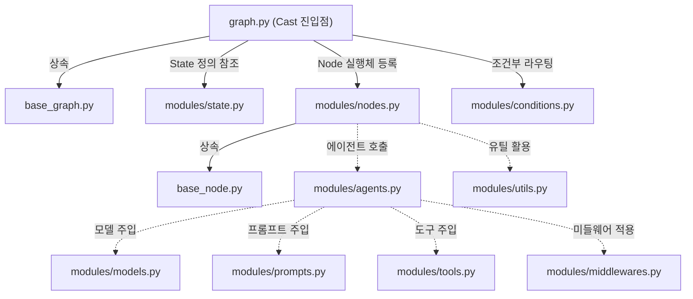
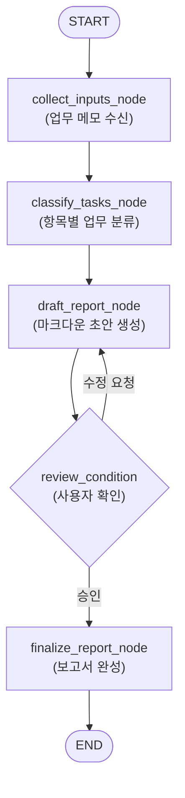

# 1주차: 환경 구축 및 아키텍처 설계 (Setup & Architecting)

> **목표**: Act Operator의 프로젝트 구조(Act vs Cast)를 이해하고, AI와 협업하여 첫 번째 그래프 아키텍처를 설계합니다.
>
> **최종 확인일**: 2026-08-26 · 최신 공식 문서 기준

---

## 📋 학습 체크리스트

- [ ] Step 1: 개발 환경 준비 (Python, uv, Git, AI 도구)
- [ ] Step 2: Act Operator 설치 및 프로젝트 생성 (`act new`)
- [ ] Step 3: Act vs Cast 개념 및 Harness 패턴 이해
- [ ] Step 4: 프로젝트 폴더 구조 및 번들된 에셋 분석
- [ ] Step 5: 모듈 의존성 및 데이터 흐름 이해
- [ ] Step 6: AI 설계 협업 — `architecting-act` 스킬
- [ ] Step 7: 실습 과제 — "주간 업무 보고서 작성기" Cast 설계
- [ ] 마무리: 복습 퀴즈

---

## Step 1: 개발 환경 준비

### 1.1 필수 소프트웨어

| 소프트웨어 | 최소 버전 | 설치 확인 명령어 | 비고 |
|:---:|:---:|:---:|---|
| **Python** | `3.11+` | `python --version` | 최신 타입 힌트(`tomllib`, `slots`) 지원 |
| **uv** | 최신 | `uv --version` | 초고속 Rust 기반 패키지/환경 관리자 |
| **Git** | 최신 | `git --version` | 버전 관리 및 협업 |

### 1.2 uv 설치

`uv`는 Astral에서 개발한 Rust 기반의 고속 Python 패키지 매니저로, `pip` 및 `virtualenv` 대비 10~100배 빠른 속도를 제공합니다.

```bash
# Windows (PowerShell)
powershell -ExecutionPolicy ByPass -c "irm https://astral.sh/uv/install.ps1 | iex"

# macOS / Linux
curl -LsSf https://astral.sh/uv/install.sh | sh
```

설치 후 정상 동작 여부를 확인합니다:

```bash
uv --version
```

### 1.3 AI 코딩 도구 지원

Act Operator는 Harness 패턴을 기반으로 AI와 인간 개발자가 동일한 컨텍스트에서 일하도록 설계되었습니다.

| AI 도구 | 스킬 디렉터리 | 지원 및 특징 |
|:---:|:---:|---|
| **Claude Code** | `.claude/skills/` | 기본 내장 스킬 자동 인식 (`/architecting-act` 등) |
| **Antigravity** | `.claude/skills/` or `.gemini/` | 기본 탑재 스킬 및 워크플로우 지원 |
| **Cursor** | `.cursor/skills/` | 프로젝트 설정 후 심볼릭 링크 또는 디렉터리 연동 |
| **Gemini CLI** | `.gemini/skills/` | 커스텀 스킬 디렉터리 지원 |

---

## Step 2: Act Operator 설치 및 프로젝트 생성

### 2.1 대화형(Interactive) 프로젝트 생성

별도의 사전 설치 없이 `uvx`를 통해 최신 `act-operator`를 바로 실행할 수 있습니다:

```bash
uvx --from act-operator act new
```

실행 시 대화형 프롬프트가 표시됩니다:

```text
? 경로 : .                     ← 현재 디렉터리 생성 (또는 ./my_project 등 새 경로)
? 언어 (Language): 한국어 (kr)  ← 템플릿 언어 선택 (한국어 kr / English en)
? Act 이름: report_system      ← 프로젝트(Act) 전체 이름 (kebab/snake 모두 가능)
? Cast 이름: weekly_report     ← 첫 번째 워크플로우(Cast) 이름
```

### 2.2 비대화형(CLI 플래그) 프로젝트 생성

자동화 스크립트나 CI 환경에서는 옵션 플래그를 직접 전달할 수 있습니다:

```bash
uvx --from act-operator act new \
  --path ./report_system \
  --act-name "Report System" \
  --cast-name "Weekly Report" \
  --lang kr
```

| 옵션 플래그 | 설명 | 기본값 |
|---|---|---|
| `--path`, `-p` | 프로젝트가 생성될 디렉터리 경로 | 현재 디렉터리 (`.`) |
| `--act-name`, `-a` | Act (모노레포) 이름 | 프롬프트 입력 |
| `--cast-name`, `-c` | 최초 생성될 Cast (그래프 모듈) 이름 | 프롬프트 입력 |
| `--lang`, `-l` | 템플릿 언어 (`kr` 또는 `en`) | `en` |

### 2.3 의존성 설치 및 동기화

생성된 프로젝트 디렉터리로 이동하여 가상 환경과 의존성을 동기화합니다:

```bash
cd report_system
uv sync
```

> [!NOTE]
> `uv sync`는 루트 `pyproject.toml`과 각 Cast의 의존성을 분석하여 `.venv/`에 모든 라이브러리를 동기화하고 `uv.lock` 락파일을 생성/검증합니다.

### 2.4 개발 환경 확인

```bash
# LangGraph 개발 서버 구동 테스트 (macOS / Linux)
uv run langgraph dev

# Windows (PowerShell) 환경: 한글 주석으로 인한 cp949 디코딩 오류 방지
$env:PYTHONUTF8=1; uv run langgraph dev
```

> [!TIP]
> **Windows 환경 사용자 팁**: Windows 환경에서 `.env` 파일의 한글 주석 등으로 인해 `UnicodeDecodeError (cp949)`가 발생하는 경우 `$env:PYTHONUTF8=1`을 설정하여 실행하세요.

`http://localhost:8000`에서 LangGraph Studio가 정상 구동되면 환경 준비가 완료된 것입니다.

---

## Step 3: Act vs Cast 개념 및 Harness 패턴

### 3.1 컨텍스트 격차(Context Gap)와 Harness 패턴

AI 코딩 어시스턴트 사용 시 발생하는 가장 큰 문제는 **"세션이 바뀌면 아키텍처를 잊어버리고 제각각의 코드를 짜는 현상(Context Gap)"**입니다.

Act Operator는 이를 3단계 Harness로 해결합니다:
1. **Scaffolding (`act new`)**: 사전에 엄격히 구조화된 디렉터리와 베이스 클래스를 제공
2. **Executable SSOT (단일 진실 공급원)**: `CLAUDE.md`, `state.py`, `Drawkit` 다이어그램으로 설계 지식을 코드베이스에 영구 보존
3. **Feedback Loop (Agent Skills)**: 에이전트가 정해진 규칙과 인터뷰 프로토콜에 따라 코드를 작성하도록 강제

### 3.2 Act vs Cast 비교

```text
🎬 Act = 영화 한 편 (전체 모노레포 프로젝트)
   🎭 Cast = 배역/역할 (개별 StateGraph 독립 패키지)
```

| 구분 | Act (프로젝트) | Cast (워크플로우/그래프) |
|:---:|---|---|
| **범위** | 전체 모노레포 리포지토리 | 독립적인 단일 `StateGraph` 단위 |
| **위치** | 프로젝트 루트 | `casts/<cast_name>/` |
| **패키징** | 루트 `pyproject.toml`, `langgraph.json` | 서브 패키지 `pyproject.toml`, `graph.py` |
| **역할** | 인프라, 공통 설정, Cast 간 오케스트레이션 | 비즈니스 로직, 노드, 상태, 미들웨어, 도구 |

---

## Step 4: 프로젝트 폴더 구조 분석

`act new`로 생성된 프로젝트의 전체 구조입니다:

```
report_system/                      ← Act (모노레포 루트)
├── .claude/
│   └── skills/                     ← 번들된 5대 Agent Skills
│       ├── architecting-act/       ← 아키텍처 및 요구사항 설계 스킬
│       ├── developing-cast/        ← LangChain v1 그래프 구현 스킬
│       ├── engineering-act/        ← 모노레포 의존성 및 서브그래프 연동 스킬
│       ├── testing-cast/           ← pytest 유닛/통합 테스트 자동화 스킬
│       └── publishing-act/         ← 패키징 및 배포 스킬
├── casts/                          ← Cast 모듈 저장소
│   ├── base_node.py                ← 모든 노드의 표준 베이스 클래스
│   ├── base_graph.py               ← 모든 그래프의 표준 베이스 클래스
│   └── weekly_report/              ← Cast 모듈 (생성된 워크플로우)
│       ├── modules/                ← 핵심 컴포넌트 디렉터리
│       │   ├── state.py            ← [필수] State/InputState/OutputState 스키마
│       │   ├── nodes.py            ← [필수] BaseNode 상속 노드 구현체
│       │   ├── graph.py            ← [필수] StateGraph 조립 및 컴파일 진입점
│       │   ├── agents.py           ← [선택] create_agent 기반 에이전트
│       │   ├── tools.py            ← [선택] @tool 도구 정의
│       │   ├── models.py           ← [선택] LLM 모델 설정
│       │   ├── conditions.py       ← [선택] 조건부 라우팅 함수
│       │   ├── middlewares.py      ← [선택] 라이프사이클 미들웨어
│       │   ├── prompts.py          ← [선택] 프롬프트 템플릿
│       │   └── utils.py            ← [선택] 헬퍼 유틸리티
│       ├── README.md               ← Cast 전용 설명서
│       └── pyproject.toml          ← Cast 전용 메타데이터
├── tests/                          ← 전체 테스트 스위트
├── drawkit_kr.xml                  ← Draw.io용 아키텍처 다이어그램 템플릿
├── langgraph.json                  ← LangGraph Studio 진입점 등록
├── pyproject.toml                  ← 루트 패키지 및 공유 의존성 설정
└── README.md                       ← 프로젝트 안내 문서
```

---

## Step 5: 모듈 의존성 및 데이터 흐름

### 5.1 모듈 간 참조 관계 (Dependency Graph)



### 5.2 런타임 데이터 흐름 (Runtime Flow)

1. `graph.py`: 사용자의 입력을 `InputState`로 수신하여 그래프 실행 시작
2. `nodes.py`: 각 노드의 `execute()` 메서드가 호출되어 비즈니스 로직 및 LLM/도구 실행
3. `state.py`: 노드의 반환값이 State에 업데이트 (채널 리듀서 적용)
4. `conditions.py`: 현재 State를 기반으로 다음 이동할 노드(Edge) 결정
5. `graph.py`: 최종 `OutputState` 필드만 필터링하여 사용자에게 응답 반환

---

## Step 6: AI 설계 협업 — `architecting-act` 스킬

### 6.1 `architecting-act` 스킬의 역할

`architecting-act`는 사용자의 모호한 요구사항을 20-Questions(스무고개) 인터뷰 기법을 통해 구체화하고, 검증된 LangGraph 토폴로지로 변환하는 AI 설계 스킬입니다.

### 6.2 대화 흐름 예시

```text
🧑 사용자: "@architecting-act를 사용하여 주간 업무 보고서 자동 생성기를 설계해줘."

🤖 AI (architecting-act 스킬 가동):
"주간 업무 보고서 시스템 설계를 시작합니다. 몇 가지 핵심 질문을 드리겠습니다:
1. 주간 업무 데이터의 주요 입력 소스는 무엇인가요? (텍스트 직접 입력 / Jira / Slack / Git 등)
2. 생성될 보고서의 주요 카테고리(완료 업무, 진행 중, 다음 주 계획 등)는 어떻게 구성되나요?
3. 최종 보고서 발송 전 사람의 승인/검토(Human-in-the-loop)가 필요한가요?
4. 출력물 형식은 마크다운인가요, 아니면 이메일/Slack 전송인가요?"
```

### 6.3 결과물: `CLAUDE.md` 명세서

인터뷰가 완료되면 AI는 프로젝트 루트 및 해당 Cast 폴더에 `CLAUDE.md` 설계 문서를 생성/갱신합니다:
- **State 스키마**: TypedDict 기반의 상태 명세
- **Mermaid 다이어그램**: 노드와 엣지의 흐름도
- **노드 명세서**: 각 노드의 입출력 및 구현 지침
- **필요 도구 및 미들웨어 목록**

---

## Step 7: 실습 과제 — "주간 업무 보고서 작성기"

### 7.1 실습 목표

- `act new`로 프로젝트를 생성하고 모듈 구조를 직접 확인합니다.
- `@architecting-act` 스킬을 호출하여 인터뷰를 진행하고 아키텍처 다이어그램을 도출합니다.

### 7.2 실습 가이드

#### [실습 1] 프로젝트 생성 및 의존성 동기화

```bash
# 1. 새 실습 프로젝트 생성
uvx --from act-operator act new --path ./week1_practice --act-name "Report Act" --cast-name "weekly_reporter" --lang kr

# 2. 디렉터리 이동 및 의존성 설치
cd week1_practice
uv sync
```

#### [실습 2] 구조 점검

- `casts/weekly_reporter/modules/state.py`
- `casts/weekly_reporter/modules/nodes.py`
- `casts/weekly_reporter/graph.py`
- `langgraph.json`

위 파일들이 정상 생성되었는지 확인합니다.

#### [실습 3] AI에게 아키텍처 설계 요청

AI 어시스턴트 프롬프트에 아래 내용을 입력하세요:

```text
@architecting-act weekly_reporter Cast에 대한 아키텍처를 설계해줘.

요구사항:
1. 사용자가 1주일간 진행한 업무 메모(불렛 포인트 텍스트)를 입력받음
2. AI가 내용을 분석하여 [완료된 주요 성과], [진행 중인 업무], [차주 계획 및 이슈]로 분류
3. 마크다운 형식의 깔끔한 보고서 초안 생성
4. 사용자 승인(Review) 노드를 거쳐 최종 출력
```

#### [실습 4] 도출될 예상 아키텍처 (Mermaid)



---

## 🧠 복습 퀴즈

<details>
<summary><b>Q1. Act Operator에서 'Act'와 'Cast'의 구조적 차이는 무엇인가요?</b></summary>

- **Act**: 최상위 모노레포 프로젝트 자체로, 전체 설정, 배포 인프라 및 공유 라이브러리를 관리합니다.
- **Cast**: Act 내부(`casts/` 디렉터리)에 속한 독립 패키지 형태의 단일 `StateGraph` 모듈입니다.
</details>

<details>
<summary><b>Q2. Cast를 구성할 때 반드시 구현해야 하는 최소 3대 핵심 파일은?</b></summary>

1. `modules/state.py`: 그래프 데이터 흐름의 규격을 정하는 State 스키마
2. `modules/nodes.py`: 실제 비즈니스 로직을 수행하는 노드 함수/클래스
3. `graph.py`: 노드와 엣지를 조립하여 StateGraph를 빌드하는 진입점
</details>

<details>
<summary><b>Q3. 신규 프로젝트 생성 후 가상환경과 의존성을 설치하기 위해 실행하는 uv 명령어는?</b></summary>

`uv sync`
</details>

<details>
<summary><b>Q4. AI와의 아키텍처 설계 인터뷰를 시작할 때 호출하는 번들 스킬의 이름은?</b></summary>

`architecting-act` (또는 `@architecting-act`)
</details>

---

## 📚 참고 자료

- [Act Operator GitHub 저장소](https://github.com/Proact0/act-operator)
- [README_KR.md (프로젝트 한국어 문서)](../README_KR.md)
- [AGENTS.md (AI 에이전트 표준 가이드)](../AGENTS.md)
- [uv 공식 문서](https://docs.astral.sh/uv/)
- [LangGraph 공식 가이드](https://langchain-ai.github.io/langgraph/)

---

## ⏭️ 다음 주차 예고

> **2주차: 핵심 로직 구현과 v1 패턴 적용**에서는 LangChain v1의 `create_agent` 패턴을 활용하여 `state.py`, `nodes.py`, `tools.py`를 직접 구현하고 실제로 실행 가능한 에이전트 루프를 완성합니다.
