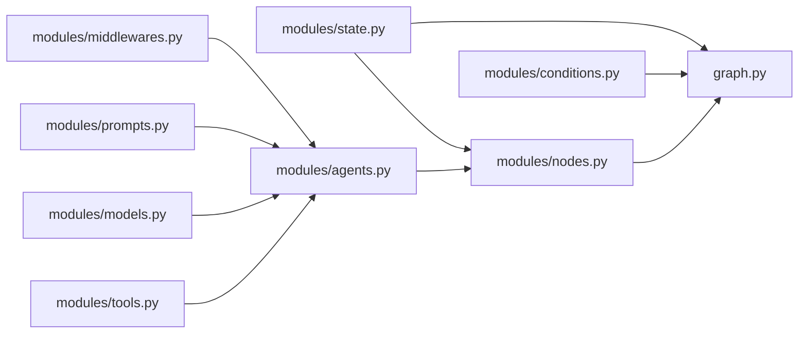
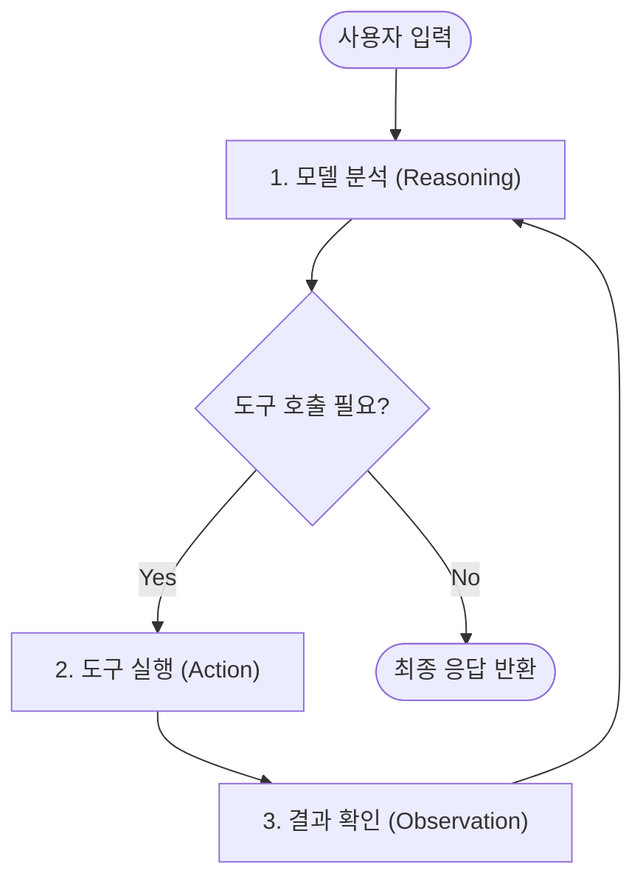

# 2주차: 핵심 로직 구현과 v1 패턴 적용 (Implementation & LangChain v1)

> **목표**: LangChain v1의 새로운 패턴인 `create_agent`와 Act Operator의 표준 모듈 체계를 활용하여 비즈니스 로직을 구현합니다.
>
> **최종 확인일**: 2026-08-26 · 최신 공식 문서 기준

---

## 📋 학습 체크리스트

- [ ] Step 1: `developing-cast` 스킬의 역할 및 패턴 이해
- [ ] Step 2: 모듈별 구현 순서와 워크플로우 파악
- [ ] Step 3: State 스키마 정의 (`state.py`)
- [ ] Step 4: 도구 구현 (`tools.py`)
- [ ] Step 5: 모델 팩토리 설정 (`models.py`)
- [ ] Step 6: 프롬프트 템플릿 작성 (`prompts.py`)
- [ ] Step 7: 에이전트 구성 (`agents.py`) — `create_agent` 패턴
- [ ] Step 8: 노드 클래스 구현 (`nodes.py`) — `BaseNode` 상속
- [ ] Step 9: 그래프 조립 및 컴파일 (`graph.py`) — `BaseGraph` 상속
- [ ] Step 10: 실습 과제 — 검색 도구 + 답변 생성 노드 완성
- [ ] 마무리: 복습 퀴즈 & 실전 트러블슈팅

---

## Step 1: `developing-cast` 스킬 이해

### 1.1 스킬의 역할

`developing-cast`는 1주차에서 `architecting-act`로 도출한 `CLAUDE.md` 설계 명세를 **실제 동작하는 파이썬 코드**로 변환하는 핵심 구현 스킬입니다.

### 1.2 스킬 호출 방법

```text
💬 AI 프롬프트 예시:
"@developing-cast를 사용하여 weekly_report Cast의 모듈들을 순차적으로 구현해줘."
```

스킬 실행 시 AI가 수행하는 자동 프로세스:
1. 루트 `/CLAUDE.md`에서 Act 전체 아키텍처 및 공통 규칙 확인
2. 해당 Cast `/casts/{cast_snake}/CLAUDE.md`에서 상태 스키마, 노드 명세, 다이어그램 파악
3. 엄격한 구현 순서(`state` → `tools/models/prompts` → `agents` → `nodes` → `conditions` → `graph`)에 따라 파일 작성

### 1.3 내장 구현 패턴 카테고리 (50+ Patterns)

| 카테고리 | 주요 패턴 | 활용 목적 |
|:---:|---|---|
| **Core** | `state.md`, `node.md`, `edge.md`, `graph.md` | 필수 컴포넌트 표준 스캐폴딩 |
| **Agents** | `configuration.md`, `structured-output.md` | `create_agent` 기반 에이전트 루프 |
| **Tools** | `basic-tool.md`, `access-context.md` | `@tool` 데코레이터 및 런타임 주입 |
| **Models** | `select-chat-models.md`, `init-chat-model.md` | 모델 팩토리 및 공급자 추상화 |
| **Memory** | `add-to-agent.md`, `checkpointer.md` | 단기/장기 지속성 상태 저장 |
| **Middleware** | `human-in-the-loop.md`, `summarization.md`, `pii.md` | 라이프사이클 훅 및 안전장치 |

---

## Step 2: 구현 순서와 워크플로우

### 2.1 정해진 구현 순서 (Strict Order)

Act Operator 프로젝트는 순환 참조를 방지하고 타입 안정성을 확보하기 위해 **엄격한 하향식 순서**를 따릅니다:

```text
1. state.py           ← 🏗️ [기초] InputState / OutputState / State 정의
   ↓
2. 의존성 모듈들       ← 🔧 [부품] tools.py, models.py, prompts.py, agents.py, middlewares.py
   ↓
3. nodes.py           ← ⚙️ [로직] BaseNode를 상속받은 비즈니스 로직 노드
   ↓
4. conditions.py      ← 🔀 [분기] 조건부 엣지 라우팅 함수 (선택)
   ↓
5. graph.py           ← 🏭 [조립] StateGraph 빌드, 노드/엣지 연결 및 compile()
```

### 2.2 모듈 간 참조 다이어그램



---

## Step 3: State 정의 (`state.py`)

State는 그래프 전체에서 노드 간 데이터를 교환하는 **단일 진실 공급원(SSOT)**입니다.

### 3.1 3-State 분리 패턴 (InputState, OutputState, State)

외부 인터페이스를 깔끔하게 유지하면서 내부에서 풍부한 상태를 다루기 위해 3개의 클래스로 분리합니다:

```python
# casts/{cast_name}/modules/state.py
from __future__ import annotations

from typing import Annotated
from langchain_core.messages import AnyMessage
from langgraph.graph import MessagesState
from langgraph.graph.message import add_messages
from typing_extensions import TypedDict


class InputState(TypedDict):
    """외부 사용자가 그래프에 전달하는 최초 입력."""
    query: str


class OutputState(TypedDict):
    """그래프 실행 완료 후 외부에 최종 반환되는 결과."""
    result: str


class State(MessagesState):
    """그래프 내부 노드들이 공유하는 전체 상태.
    
    MessagesState 상속 시 messages: Annotated[list[AnyMessage], add_messages] 자동 포함
    """
    query: str
    result: str
    search_results: list[str]
    revision_count: int
```

### 3.2 Reducer 작동 원리

| Reducer | 동작 방식 | 코드 예시 |
|:---:|---|---|
| **기본 (None)** | 이전 값을 새 값으로 **덮어쓰기(Overwrite)** | `result: str` |
| **`operator.add`** | 리스트나 숫자를 **누적 추가(Append/Sum)** | `items: Annotated[list[str], operator.add]` |
| **`add_messages`** | 메시지 ID 기반 **스마트 병합(Merge/Append)** | `messages: Annotated[list[AnyMessage], add_messages]` |

---

## Step 4: 도구 구현 (`tools.py`)

도구(Tool)는 에이전트가 외부 검색 엔진, 데이터베이스, API와 상호작용하는 진입점입니다.

### 4.1 `@tool` 데코레이터를 이용한 도구 정의

```python
# casts/{cast_name}/modules/tools.py
from __future__ import annotations

from langchain_core.tools import tool


@tool
def web_search(query: str, max_results: int = 5) -> str:
    """웹 검색 엔진을 통해 실시간 정보를 검색합니다.

    Args:
        query: 검색할 질문 또는 핵심 키워드
        max_results: 반환할 최대 결과 수 (기본값 5)
    """
    # 실습용 Mock 데이터 (Tavily 연동 전 테스트)
    return f"'{query}'에 대해 검색된 {max_results}개의 최신 정보입니다."
```

> [!IMPORTANT]
> - 모든 파라미터에 **타입 힌트**를 필수로 명시해야 합니다.
> - LLM은 함수의 **Docstring**을 읽고 어떤 도구를 쓸지 판단하므로, 설명과 `Args`를 명확하게 기술해야 합니다.

---

## Step 5: 모델 팩토리 설정 (`models.py`)

모델 설정을 중앙 집중식 팩토리 함수로 관리하여 환경에 따라 모델을 유연하게 교체합니다.

```python
# casts/{cast_name}/modules/models.py
from __future__ import annotations

import os
from langchain_openai import ChatOpenAI


def get_chat_model(temperature: float = 0.1) -> ChatOpenAI:
    """기본 OpenAI Chat 모델을 반환합니다."""
    return ChatOpenAI(
        model=os.getenv("OPENAI_MODEL_NAME", "gpt-4o"),
        temperature=temperature,
        timeout=30,
    )
```

---

## Step 6: 프롬프트 관리 (`prompts.py`)

```python
# casts/{cast_name}/modules/prompts.py
from __future__ import annotations


def get_system_prompt() -> str:
    """리서치 에이전트 시스템 프롬프트 반환."""
    return (
        "당신은 신뢰할 수 있는 전문 리서치 어시스턴트입니다.\n"
        "제공된 검색 도구를 활용하여 최신 정보를 수집하고 정확한 사실에 기반해 답변하세요."
    )
```

---

## Step 7: 에이전트 구성 (`agents.py`) — `create_agent` 패턴

### 7.1 LangChain v1 `create_agent` 마이그레이션

LangChain v1에서는 레거시 `create_react_agent` 대신 **`create_agent`**를 사용합니다:

```python
# casts/{cast_name}/modules/agents.py
from __future__ import annotations

from langchain.agents import create_agent
from .models import get_chat_model
from .prompts import get_system_prompt
from .tools import web_search


def create_search_agent():
    """검색 도구와 시스템 프롬프트가 결합된 LangChain v1 에이전트 생성."""
    return create_agent(
        model=get_chat_model(),
        tools=[web_search],
        system_prompt=get_system_prompt(),
    )
```

### 7.2 ReAct 에이전트 실행 루프



---

## Step 8: 노드 구현 (`nodes.py`) — `BaseNode` 상속

모든 노드는 `casts.base_node.BaseNode`를 상속하여 표준 인터페이스와 로깅 기능을 갖춥니다.

```python
# casts/{cast_name}/modules/nodes.py
from __future__ import annotations

from typing import Any
from langchain_core.messages import AIMessage, HumanMessage
from casts.base_node import BaseNode
from .agents import create_search_agent


class InputNode(BaseNode):
    """사용자 입력을 메시지 형식으로 변환하는 노드."""

    def __init__(self) -> None:
        super().__init__(verbose=True)

    def execute(self, state: dict[str, Any]) -> dict[str, Any]:
        query = state.get("query", "")
        self.log(f"Received user query: {query}")
        return {
            "messages": [HumanMessage(content=query)]
        }


class SearchAgentNode(BaseNode):
    """LangChain v1 ReAct 에이전트를 실행하는 노드."""

    def __init__(self) -> None:
        super().__init__(verbose=True)
        self.agent = create_search_agent()

    def execute(self, state: dict[str, Any]) -> dict[str, Any]:
        self.log("Invoking search agent...")
        response = self.agent.invoke({
            "messages": state["messages"]
        })
        
        last_message = response["messages"][-1]
        return {
            "messages": response["messages"],
            "result": last_message.content,
        }
```

> [!TIP]
> - `execute()` 메서드는 반드시 State를 업데이트할 **dict**를 반환해야 합니다.
> - `self.log(...)`는 `verbose=True`일 때 실행 흐름을 보기 쉽게 콘솔에 출력해 줍니다.

---

## Step 9: 그래프 조립 (`graph.py`) — `BaseGraph` 상속

`BaseGraph`를 상속받아 `StateGraph`에 노드와 엣지를 연결하고 컴파일합니다.

```python
# casts/{cast_name}/graph.py
from __future__ import annotations

from langgraph.graph import StateGraph, START, END
from casts.base_graph import BaseGraph
from casts.{cast_name}.modules.state import InputState, OutputState, State
from casts.{cast_name}.modules.nodes import InputNode, SearchAgentNode


class SmartSearchGraph(BaseGraph):
    """스마트 검색 Cast의 StateGraph 정의 클래스."""

    def __init__(self) -> None:
        super().__init__()
        self.input = InputState
        self.output = OutputState
        self.state = State

    def build(self):
        """노드와 엣지를 조립하여 컴파일된 그래프를 반환합니다."""
        builder = StateGraph(
            self.state,
            input_schema=self.input,
            output_schema=self.output
        )

        # 1. 노드 등록 (반드시 클래스 인스턴스를 전달!)
        builder.add_node("input_node", InputNode())
        builder.add_node("search_node", SearchAgentNode())

        # 2. 엣지 연결
        builder.add_edge(START, "input_node")
        builder.add_edge("input_node", "search_node")
        builder.add_edge("search_node", END)

        # 3. 컴파일 및 반환
        graph = builder.compile()
        graph.name = self.name
        return graph


# langgraph.json에서 참조할 인스턴스 생성
smart_search_graph = SmartSearchGraph()
```

---

## Step 10: 실습 과제 — 검색 도구 + 답변 생성 노드

### 10.1 과제 목표

1. `smart_search` Cast에 `state.py` → `tools.py` → `models.py` → `agents.py` → `nodes.py` → `graph.py`를 구현합니다.
2. `langgraph dev`를 실행하고 LangGraph Studio에서 질의를 전송하여 결과를 확인합니다.

### 10.2 의존성 추가 및 환경 설정

```bash
# 1. OpenAI 패키지 추가 (해당 Cast 패키지에 추가)
uv add --package smart_search langchain-openai

# 2. .env 파일 생성 (UTF-8 인코딩)
# PowerShell 사용 시:
Set-Content -Path .env -Value "OPENAI_API_KEY=your-api-key-here" -Encoding utf8

# 3. LangGraph Studio 서버 실행
uv run langgraph dev
```

---

## 🧠 복습 퀴즈

<details>
<summary><b>Q1. Act Operator에서 권장하는 모듈 구현 순서는?</b></summary>

`state.py` ➔ `tools.py / models.py / prompts.py` ➔ `agents.py` ➔ `nodes.py` ➔ `conditions.py` ➔ `graph.py`
</details>

<details>
<summary><b>Q2. `builder.add_node("search", SearchNode)` 코드의 문제점은?</b></summary>

노드를 등록할 때는 클래스 객체가 아니라 **인스턴스(`SearchNode()`)**를 넘겨주어야 합니다.
</details>

<details>
<summary><b>Q3. LangChain v1에서 `create_react_agent` 대신 권장하는 최신 함수는?</b></summary>

`create_agent` (통합 미들웨어, 모델 설정, 구조화된 출력 지원)
</details>

<details>
<summary><b>Q4. `InputState`와 `OutputState`를 `State`와 별도로 분리하는 이유는?</b></summary>

외부 사용자와의 입출력 인터페이스는 간결하게 유지하면서, 그래프 내부에서는 중간 연산 및 대화 기록(`messages`)을 자유롭게 누적/처리하기 위함입니다.
</details>

---

## 🛠️ 실전 트러블슈팅 가이드

| 증상 | 원인 | 해결 방법 |
|---|---|---|
| `UnicodeDecodeError: 'utf-8' codec can't decode...` | Windows PowerShell에서 `echo`로 `.env` 파일 생성 시 UTF-16으로 저장됨 | `Set-Content -Path .env -Value "..." -Encoding utf8` 사용 |
| `TypeError: execute() missing 1 required positional argument` | `BaseNode`의 `execute()` 시그니처 불일치 | `def execute(self, state: dict[str, Any]) -> dict[str, Any]` 형식 확인 |
| `GraphBuilderError: Node not found in graph` | `add_edge()`에서 등록되지 않은 노드 이름 사용 | `add_node("name", ...)`와 `add_edge("name", ...)`의 이름 일치 여부 확인 |

---

## 📚 참고 자료

- [LangChain v1 Agents 공식 문서](https://docs.langchain.com/oss/python/langchain/agents)
- [LangGraph StateGraph API 레퍼런스](https://langchain-ai.github.io/langgraph/reference/graphs/)
- [developing-cast 스킬 가이드](../.claude/skills/developing-cast/SKILL.md)
- [AGENTS.md 표준 가이드](../AGENTS.md)

---

## ⏭️ 다음 주차 예고

> **3주차: 미들웨어와 제어 흐름**에서는 Human-in-the-loop(사용자 승인), Summarization(자동 대화 압축), PII(개인정보 보호) 미들웨어를 `middlewares.py`에 적용하고, 체크포인터(Checkpointer)를 통한 상태 저장 및 중단/재개 기법을 배웁니다.
